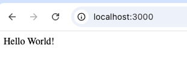

# Cloud Services & Infrastructure - Session 1 - Project kickoff & environment setup

Goal: Ensure everyone has the required setup to start coding.
Topics & Hands-on:

1. Clone project template from GitHub (if provided)
2. Set up Docker, Docker Compose, and Docker Swarm
3. Running a sample container locally
4. Creating a simple Docker Compose setup
5. Basic Traefik setup for reverse proxying

    Project Task: Teams set up their initial repo and infrastructure.

## 1. Clone project template from GitHub (if provided)

Clone this project template from the GitHub repository or just create a similar new project on your own local machine.

## 2. Set up Docker, Docker Compose, and Docker Swarm

Install Docker and Docker Compose on your local machine.

1. Go to https://www.docker.com/ and download the Docker Desktop for your operating system.
2. This installs Docker Desktop, Docker Engine, Docker compose and Docker Swarm.
3. Test that the docker works by running the following command in your terminal:

```sh
docker run hello-world
```

You should get the following output:

```sh
docker run hello-world
Unable to find image 'hello-world:latest' locally
latest: Pulling from library/hello-world
c9c5fd25a1bd: Pull complete
Digest: sha256:e0b569a5163a5e6be84e210a2587e7d447e08f87a0e90798363fa44a0464a1e8
Status: Downloaded newer image for hello-world:latest

Hello from Docker!
This message shows that your installation appears to be working correctly.

To generate this message, Docker took the following steps:
 1. The Docker client contacted the Docker daemon.
 2. The Docker daemon pulled the "hello-world" image from the Docker Hub.
    (arm64v8)
 3. The Docker daemon created a new container from that image which runs the
    executable that produces the output you are currently reading.
 4. The Docker daemon streamed that output to the Docker client, which sent it
    to your terminal.

To try something more ambitious, you can run an Ubuntu container with:
 $ docker run -it ubuntu bash

Share images, automate workflows, and more with a free Docker ID:
 https://hub.docker.com/

For more examples and ideas, visit:
 https://docs.docker.com/get-started/
```

## 3. Running a sample container locally

Lets build and run a simple container locally. This time, we will be using Nodejs (https://nodejs.org/en) to create a really simple web server and Dockerize it.

If you do not have NodeJS installed, get the latest LTS version from the official website.

In addition, installing nodejs version manager is highly suggested. It allows you to easily switch between different versions of NodeJS.
You can find it from: https://github.com/nvm-sh/nvm

You can replicate the files included in the nodejs folder in order to follow along.

1. Create yourself a new folder nodejs

2. Create a new file called app.js in the nodejs folder and add the following content to it:

###### `app.js`

```javascript
const express = require("express");
const app = express();

app.get("/", (req, res) => res.send("Hello World!"));
app.listen(3000, () => console.log("Server ready"));
```

3. Create package.json and install the required dependencies (only expressjs this time). Make sure to run the following commands in the nodejs folder:

```sh
npm init -y
npm install express
```

4. Test that the application works locally by running the following command in the nodejs folder:

```sh
node app.js
```

5. You should now be able to access the application by going to http://localhost:3000 in your browser.



6. Create a new file called Dockerfile in the nodejs folder

7. Add the following content to the Dockerfile:

###### `Dockerfile`

```Dockerfile
FROM node:22.14.0
WORKDIR /usr/src/app
COPY package*.json app.js ./
RUN npm install
EXPOSE 3000
CMD ["node", "app.js"]
```

8. Create a .dockerignore file in the nodejs folder and add the following content to it:

###### `.dockerignore`

```Dockerfile
node_modules
```

9. Lets build the docker image and see how it goes.

Remember, this must be done in the same folder as the Dockerfile.

```sh
docker build -t examplenode .
```

10. After the build is done, run the following command to run the container:

```sh
docker run -d -p 3000:3000 --name node-app examplenode
```

You should now be able to see the container running in Docker Desktop. Try also running `docker ps` to see the running containers.

```sh
CONTAINER ID   IMAGE         COMMAND                  CREATED              STATUS              PORTS                    NAMES
970980923f33   examplenode   "docker-entrypoint.s…"   About a minute ago   Up About a minute   0.0.0.0:3000->3000/tcp   node-app
```

In addition, you should be able to access the application by going to http://localhost:3000 in your browser.

Finally, stop the container by running the following command:

```sh
docker stop node-app
```

## 4. Running a sample container in docker-compose

In this section, we will start using docker-compose to define the services we want to run. This is much easier than running everything separately on a command line. We will also use a docker-compose.yml file to define the services we want to run.

Create a new file called docker-compose.yml and put it into the root folder (in this project, we consider root to be the session_1 folder).

Add the following content to the docker-compose.yml file:

###### `docker-compose.yml`

```yaml
services:
    node-app:
        image: examplenode # This is the image we have built
        ports:
            - 3000:3000 # We want to open the port 3000 of the container and show it as port 3000 of the host
```

Now, you can either use your IDE (for example VSCode) to run the docker-compose.yml file or you can run the following command (in the same folder as the docker-compose.yml file):

```sh
docker-compose up
```

And you should see following similar output:

```sh
[+] Running 2/2
 ✔ Network session_1_default       Created                                                                                          0.1s
 ✔ Container session_1-node-app-1  Created                                                                                          0.0s
Attaching to node-app-1
node-app-1  | Server ready
```

And by navigating again to http://localhost:3000, you should see the same result as before.

To stop the services, use your IDE's down tools, or run the following command on commandline (in the same folder as the docker-compose.yml file):

```sh
docker-compose down
```

### Note for VSCode users

Handy tools to use with docker-compose are the Docker extension and Docker Compose extension for VSCode. It allows you to easily run and stop the services.

Docker extension for VSCode: https://marketplace.visualstudio.com/items?itemName=ms-azuretools.vscode-docker
Docker Compose extension for VSCode: https://marketplace.visualstudio.com/items?itemName=p1c2u.docker-compose

## 3. Basic Traefik setup for reverse proxying

In order to run multiple services in a production environment (and to test them with proper URLs locall), we need to set up a reverse proxy.
There are many options for this, but we will use Traefik: https://traefik.io/traefik/

During this course, we will not install any applications locally, but use everything via Docker. You can find the Traefik installation instructions from here: https://doc.traefik.io/traefik/getting-started/install-traefik/

### Getting started
