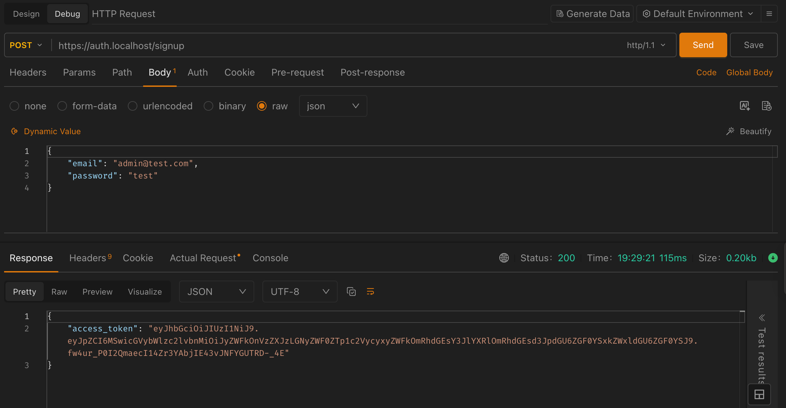
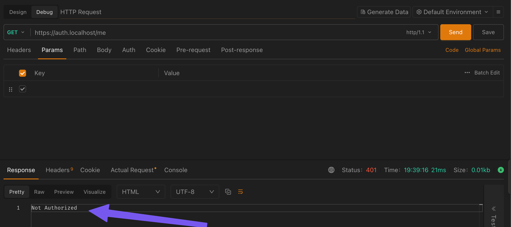
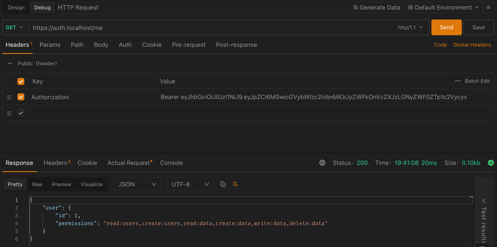
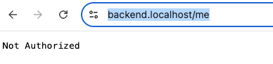
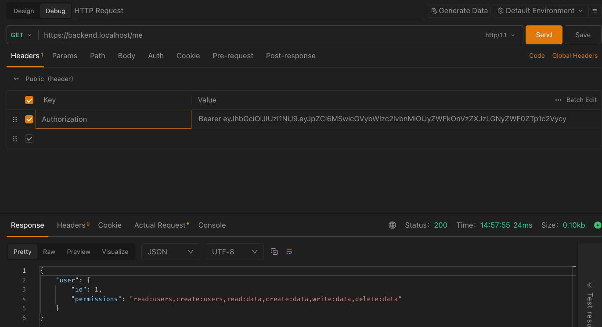

# Cloud Services & Infrastructure - Session 3 - Authentication system

Goal: Implement user authentication & security.
Topics & Hands-on:

1. Creating a new user authentication services
2. Setting up JWT-based authentication in Bunjs
3. Securing API endpoints
4. Login/logout flow in the frontend

**Project Task:** Teams integrate authentication into their systems.

## 1. Creating a new user authentication services

We will be using the Bun.js package called `auth` for this. It is a simple authentication package that allows you to create users, login, logout, and verify tokens.

Let's create the new auth service as we did with the backend.

```sh
bun create elysia auth
cd auth
# Let's add couple of dependencies
bun add @elysiajs/jwt @elysiajs/cors @elysiajs/bearer @elysiajs/swagger
bun dev
```

Change the project to be run in a different port, for example 3001.

###### **auth/src/index.ts**

```ts
import cors from "@elysiajs/cors";
import swagger from "@elysiajs/swagger";
import { Elysia } from "elysia";

const app = new Elysia()
    .use(swagger())
    .use(cors())
    .get("/", () => "Hello from auth!")
    .listen(3001);

console.log(
    `🦊 Elysia is running at ${app.server?.hostname}:${app.server?.port}`
);
```

Next, create the Dockerfile and .dockerignore for the auth service. (Check from session 2 how to do this.).
Update the build_docker_images.sh to build the auth service as well.

###### **build_docker_images.sh**

```bash
#!/bin/bash
# build_docker_images.sh
# Builds the docker images for the project
echo "Starting to build the docker images..."

echo "building project-auth:dev..."
docker build -f auth/Dockerfile -t project-auth:dev auth/
echo "project-auth:dev DONE"

echo "building project-backend:dev..."
docker build -f backend/Dockerfile -t project-backend:dev backend/
echo "project-backend:dev DONE"

echo "building project-ui:dev..."
docker build -f ui/Dockerfile -t project-ui:dev ui/
echo "project-ui:dev DONE"
```

**NOTE WE NEED TO UPDATE CERTIFICATES TO ALLOW FOR auth.localhost**. Remember to create that in order to get docker stack to work with HTTPS.

Now, we need to update the docker-compose.yml file. The docker-compose.yml parts of previous sessions are omitted in order to keep the file shorter.

##### **docker-compose.yml**

```yaml
auth:
    image: project-auth:dev # This is the image we have built. If missing, check build_images.sh
    volumes:
        - ./auth:/usr/src/app # We want to mount our local auth folder to the container
    networks:
        - cloud_project # Note the network is the same as for traefik! Otherwise this won't work!
    command: bun dev # This is the command we want to run. We are now overriding the default command.
    environment:
        - PORT=3001 # We want to set the port in the environment variables
        - JWT_SECRET=secret # We want to set the JWT_SECRET in the environment variables
    labels:
        - "traefik.enable=true"
        - "traefik.http.routers.auth.rule=Host(`auth.localhost`)" # This is the backend service URL
        - "traefik.http.routers.auth.entrypoints=websecure"
        - "traefik.http.routers.auth.tls=true"
        - "traefik.http.services.auth.loadbalancer.server.port=3001"
```

All right, we should be now able to start this service as well! One more service in our stack! That makes it already 5 services!

## 2. Setting up JWT based authentication in Bunjs

First, we have to create all the required routes, a model for the user and middleware for checking for JWT.

Start by creating a JWT configuration file `jwtConfig.js`

###### **config/jwtConfig.ts**

```ts
// auth/src/jwt.ts

import { jwt } from "@elysiajs/jwt";

export const jwtConfig = jwt({
    name: "jwt_auth",
    secret: process.env.JWT_SECRET || "your-secret-key"
});
```

Next, we need to create authorization middleware

###### **middleware/authorization.ts**

```ts
// auth/src/middleware/authorization.ts

export const authorizationMiddleware = async ({
    headers,
    jwt_auth
}: {
    headers: any;
    jwt_auth: any;
}) => {
    // 1. Extract the 'Authorization' header from the incoming request
    const auth = headers["authorization"];

    // 2. Check if the 'Authorization' header contains a Bearer token
    //    If it starts with 'Bearer ', extract the token string after 'Bearer '
    //    Otherwise, set token to null indicating no valid token is present
    const token = auth && auth.startsWith("Bearer ") ? auth.slice(7) : null;

    // 3. If no token is found, return an object with user set to null
    if (!token) return { user: null };

    // 4. Verify the JWT token using the jwt_auth module
    //    This step authenticates the token and retrieves the user information
    const user = await jwt_auth.verify(token);

    // 5. Return an object containing the authenticated user information
    //    This will be available inside de request object
    return { user };
};
```

And then, we need a model for the user.

###### **models/userModel.ts**

```ts
// auth/src/models/userModel.ts

import { t } from "elysia";

const users: User[] = []; // Mock User DB

const defaultPermissions = [
    "read:users",
    "create:users",
    "read:data",
    "create:data",
    "write:data",
    "delete:data"
];

/**
 * User Data Transfer Object
 */
export const UserDTO = {
    findUserByEmail: (email: string) => {
        return users.find((user) => user.email === email);
    },
    createUser: async (user: UserModelForSignup) => {
        const newUser: User = {
            ...user,
            id: users.length + 1,
            password: await Bun.password.hash(user.password),
            permissions: defaultPermissions
        };

        users.push(newUser);

        return newUser;
    },
    verifyPassword: async (password: string, hash: string) => {
        return await Bun.password.verify(password, hash);
    }
};

export const userModelForSignup = t.Object({
    email: t.String(),
    password: t.String()
});

export type UserModelForSignup = typeof userModelForSignup.static;

export type User = typeof userModel.static;

export const userModel = t.Object({
    id: t.Number(),
    email: t.String(),
    password: t.String(),
    permissions: t.Array(t.String())
});
```

And now we are only missing the routes to our application

###### **routes/loginRouter.ts**

```ts
import Elysia, { t } from "elysia";
import { jwtConfig } from "../config/jwtConfig";
import { UserDTO, userModel, userModelForSignup } from "../models/userModel";

export const loginRouter = new Elysia().use(jwtConfig).post(
    "/login",
    async ({ body, error, jwt_auth }) => {
        // 1. Ensure the user already exists.
        const foundUser = UserDTO.findUserByEmail(body.email);

        // 2. If not, return an error; otherwise, authenticate.
        if (!foundUser) return error(400, "User does not exist");

        // 3. Verify the password.
        const isPasswordCorrect = await UserDTO.verifyPassword(
            body.password,
            foundUser.password
        );

        // 4. If the password doesn't match, return an error.
        if (!isPasswordCorrect) error(400, "Password is incorrect");

        // 5. Tokenize the results with JWT and return the token.
        const token = await jwt_auth.sign({
            id: foundUser.id,
            permissions: foundUser.permissions.toString()
        });

        console.log("Token created!");
        console.log(token);

        if (!token) return error(400, "Problems creating token");

        // 6. Return the token.
        return { access_token: token };
    },
    {
        body: userModelForSignup
    }
);
```

###### **routes/signupRouter.ts**

```ts
// auth/src/routes/signUpRoute.ts

import Elysia, { t } from "elysia";
import { UserDTO, userModel, userModelForSignup } from "../models/userModel";
import { jwtConfig } from "../config/jwtConfig";

export const signupRouter = new Elysia().use(jwtConfig).post(
    "/signup",
    async ({ body, error, jwt_auth }) => {
        // 1. Ensure the user does not exist yet.
        const foundUser = UserDTO.findUserByEmail(body.email);

        // 2. If the user already exists, return an error.
        if (foundUser) return error(400, "User already exists");

        // 3. Otherwise, create a new user.
        const newUser = await UserDTO.createUser({
            email: body.email,
            password: body.password
        });

        // 4. If there's an error creating the user, handle it.
        if (!newUser) return error(400, "Problems creating user");

        // 5. Tokenize the results with JWT.
        const token = await jwt_auth.sign({
            id: newUser.id,
            permissions: newUser.permissions.toString()
        });
        console.log("Token created!");
        console.log(token);

        if (!token) return error(400, "Problems creating token");

        // 6. Return the token.
        return { access_token: token };
    },
    {
        body: userModelForSignup
    }
);
```

###### **routes/protectedRouter.ts**

```ts
import Elysia from "elysia";
import { jwtConfig } from "../config/jwtConfig";
import { authorizationMiddleware } from "../middleware/authorization";

export const protectedRouter = new Elysia()
    .use(jwtConfig)
    .derive(authorizationMiddleware)
    .guard(
        {
            beforeHandle: ({ user, error }) => {
                // 1. Check if the user is authenticated
                //    If not, return a 401 error
                if (!user) return error(401, "Not Authorized");

                // 2. If the user is authenticated, return the user
                return { user };
            }
        },
        (app) =>
            app.get("/me", ({ user, error }) => {
                // 1. Check if the user object is present, indicating an authenticated user
                //    If the user is not authenticated (user is null or undefined), return a 401 error
                if (!user) return error(401, "Not Authorized");

                // 2. If the user is authenticated, return the user
                return { user };
            })
    );
```

And only thing we are missing is the `index.ts` update.

###### **index.ts**

```ts
// auth/src/index.ts

import cors from "@elysiajs/cors";
import swagger from "@elysiajs/swagger";
import { Elysia, t } from "elysia";
import { signupRouter } from "./routes/signupRouter";
import { loginRouter } from "./routes/loginRouter";
import { protectedRouter } from "./routes/protectedRouter";

const PORT = process.env.PORT || 3001;

const app = new Elysia()
    .use(swagger())
    .use(cors())
    .get("/", () => "Hello from auth!")
    .use(signupRouter)
    .use(loginRouter)
    .use(protectedRouter)
    .listen(PORT);

console.log(
    `🦊 Elysia is running at ${app.server?.hostname}:${app.server?.port}`
);
```

### Testing out the API

Now, you should be able to start the project and also access the GET and POST routes.
A handy tool to test API routes in VSCode is "EchoAPI for VSCode". This is a free software to use.

You can try to signup at the https://auth.localhost/signup. Remember to send the email+password in the JSON body.



Also, we can try and see if the authorization does work. This is done trying to access a protected route.

If you do not have the `Authorization` header, the request should be denied, as shown in the image below:



However, when we pass the proper header in the request, we get response back:



Yes! Now we should have a properly working authentication system. Of course, it is missing the connection to real database. That is a task that is up to you to add.

**EXTRA TASK: Implement proper database for user handling instead of the current in-memory trick**

## 3. Securing API endpoints

Currently our authentication API will allow users to signup & login. However, our original `backend` does no such thing. So, we have to add checking of JWT tokens into our backend. Let's see how that is implemented.

First, we must install a way to read the JWT token from the request. We will use the `@elysiajs/jwt` package for this. Lets install it (and remember to build the backend docker image again after this!)

Next, copy the `jwtConfig.ts` from the `auth` service to the `backend` service. Also, copy the `authorizationMiddleware.ts` to the `backend` service.

Next, let's modify the `backend/src/routes/index.ts` to include the `jwtConfig` and `authorizationMiddleware` into the app.

```ts
// backend/src/index.ts

import { Elysia } from "elysia";
import swagger from "@elysiajs/swagger";
import { cors } from "@elysiajs/cors";
import { getBooks } from "./database";
import { protectedRouter } from "./routes/protectedRouter";

const PORT = process.env.PORT || 3000;

const app = new Elysia()
    .use(swagger())
    .use(cors())
    .get("/", () => "Hello Elysia")
    .get("/hello", "Do you miss me?")
    .get("/books", async () => {
        const books = await getBooks();
        return JSON.stringify(books);
    })
    .use(protectedRouter)
    .listen(PORT);

console.log(
    `🦊 Elysia is running at ${app.server?.hostname}:${app.server?.port}`
);
```

Note! We must add the JWT_SECRET environment variable to the `backend` service in the `docker-compose.yml` file. This must be the same secret as the one used in the `auth` service.

Now, we can test the route. If we just navigate there, we should get a 401 error.



However, if we add the Authorization header, we should get the response back.



If we make also the /books route to be protected, we should get the same response. So now, we need to implement a login flow for the frontend.

## 4. Login/logout flow in the frontend

Let's create a simple login flow in the frontend. This will be a simple form that will send the email and password to the backend. The backend will then check if the user exists and if the password is correct. If everything is correct, the backend will return a JWT token. The frontend will then store the token in the local storage and redirect the user to the protected route.

First, we have to install react-router-dom.

```sh
bun add react-router-dom
```

Next, we can create the login page.
Create the following files:

-   components/Login.tsx
-   components/Navbar.tsx
-   components/ProtectedRoute.tsx
-   components/Signup.tsx
-   components/Auth.css
-   contexts/AuthContext.tsx
